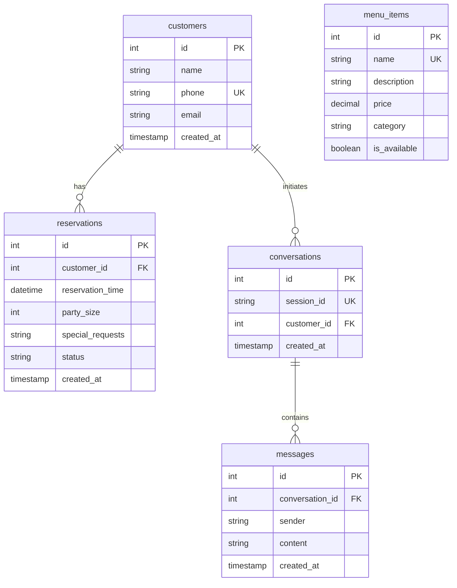

# Restaurant Receptionist AI Chatbot Service

This is a production-ready, clean-architecture backend service for a Restaurant Receptionist AI Chatbot. It manages customer registrations, restaurant table reservations, menu items, and uses Retrieval-Augmented Generation (RAG) to answer questions without hallucination.

The application is built with **Python 3.12**, **FastAPI**, **MySQL**, **SQLAlchemy**, and integrates with **Ollama** running **Llama 3**.

---

## Key Features

1. **Clean Architecture**: Strictly organized into domain models, data transfer schemas (Pydantic), repositories (data-access layer), service services (business layer), and routers (presentation layer).
2. **Repository & Service Patterns**: Decouples business rules from database access, allowing easy maintenance and testing.
3. **Conversational History Context**: Retrieves the last 10 messages of conversation history per session to provide context to the LLM.
4. **Menu RAG Search**: Matches user queries using keyword search over menu items and passes them as context.
5. **No Hallucination Prompting**: Strictly constrains the model to only answer using provided database facts.
6. **Auto-Booking & Identification Tagging**: Intercepts structured JSON outputs from Llama 3 to automatically book tables and identify customers on-the-fly.
7. **Complete Mock Test Coverage**: Integration and unit tests using SQLite in-memory, decoupled from active MySQL/Ollama requirements.

---

## Directory Structure

```
/
├── app/
│   ├── exceptions/            # Global API Exception handler
│   ├── models/                # SQLAlchemy Entity Models
│   ├── schemas/               # Pydantic Request/Response validation Schemas
│   ├── repositories/          # Repository Pattern (base + specific)
│   ├── services/              # Service Layer Pattern (business logic & Ollama API)
│   ├── routers/               # FastAPI endpoints
│   ├── config.py              # Settings loader using Pydantic Settings
│   ├── database.py            # SQLAlchemy Connection management
│   └── main.py                # Main application server & logger
├── docker/
│   ├── app.Dockerfile         # FastAPI application Docker container
│   └── docker-compose.yml     # Multi-container orchestration (MySQL + Ollama + App)
├── sql/
│   └── schema.sql             # Raw DDL SQL script and initial seeds
├── tests/
│   ├── conftest.py            # SQLite database fixtures and Ollama mocks
│   ├── test_customer.py       # Customer CRUD unit tests
│   ├── test_menu.py           # Menu search and management unit tests
│   ├── test_reservation.py    # Reservation workflow unit tests
│   └── test_chatbot.py        # Conversational integration tests
├── .env.example               # Environment variables template
├── requirements.txt           # Python application requirements
├── postman_collection.json    # Importable Postman API testing collection
└── README.md                  # Setup & Architecture document
```

---

## Database Architecture



---

## Setup & Running Guide

### Method A: Running with Docker (Recommended)

This compiles and runs the entire stack (FastAPI App, MySQL database, and Ollama) using docker compose.

1. **Start the containers**:
   ```bash
   docker-compose -f docker/docker-compose.yml up -d --build
   ```

2. **Pull the Llama 3 model** inside the Ollama container:
   ```bash
   docker exec -it ollama_service ollama pull llama3
   ```

3. **Verify the Application**:
   Open [http://localhost:8000/docs](http://localhost:8000/docs) in your browser to view the OpenAPI Swagger documentation.

---

### Method B: Running Locally

#### 1. Setup Database
Ensure you have a MySQL server running locally. Create a database named `restaurant_db`:
```sql
CREATE DATABASE restaurant_db;
```
*(Optional: Run `sql/schema.sql` to pre-seed the database, otherwise the application auto-creates the tables and schema on startup).*

#### 2. Run Ollama Locally
1. Download Ollama from [ollama.com](https://ollama.com).
2. Start the Ollama server:
   ```bash
   ollama serve
   ```
3. Pull the Llama 3 model:
   ```bash
   ollama pull llama3
   ```

#### 3. Install Python Dependencies
Create a virtual environment and install the required modules:
```bash
python -m venv venv
# On Windows
venv\Scripts\activate
# On Linux/macOS
source venv/bin/activate

pip install -r requirements.txt
```

#### 4. Configure Environment Variables
Copy `.env.example` to `.env` and verify the values match your local database and Ollama setups.
```bash
cp .env.example .env
```

#### 5. Run FastAPI App
```bash
python -m app.main
```
The server will start on [http://localhost:8000](http://localhost:8000).

---

## Running Unit and Integration Tests

The test suite uses an in-memory SQLite database and mocks the Ollama server to allow fast, isolated, and reliable test runs.

To execute the tests:
```bash
# Ensure you are in the project root directory
pytest -v
```

---

## Example API Requests & Responses

### 1. Customer Registration
* **Endpoint**: `POST /customers/`
* **Body**:
  ```json
  {
    "name": "Alice Smith",
    "phone": "+15550199",
    "email": "alice@example.com"
  }
  ```
* **Response (201 Created)**:
  ```json
  {
    "name": "Alice Smith",
    "phone": "+15550199",
    "email": "alice@example.com",
    "id": 1,
    "created_at": "2026-06-25T10:45:00"
  }
  ```

### 2. Check the Menu (RAG Search)
* **Endpoint**: `GET /menu/search?q=tiramisu`
* **Response (200 OK)**:
  ```json
  [
    {
      "name": "Tiramisu",
      "description": "Classic Italian dessert made of coffee-dipped ladyfingers layered with whipped mascarpone cheese and cocoa.",
      "price": 8.50,
      "category": "desserts",
      "is_available": true,
      "id": 9
    }
  ]
  ```

### 3. Talk to the AI Receptionist
* **Endpoint**: `POST /chatbot/chat`
* **Body**:
  ```json
  {
    "session_id": "restaurant_session_123",
    "message": "Hi, what desserts do you offer?"
  }
  ```
* **Response (200 OK)**:
  ```json
  {
    "session_id": "restaurant_session_123",
    "response": "Hello! For dessert, we serve our classic Tiramisu ($8.50), creamy Panna Cotta ($7.50), and our Gelato Trio ($6.50). Would you like to add one of these to your list or book a table?",
    "customer_id": null
  }
  ```

---

## Deployment & Production Best Practices

1. **Use Migrations**: Use **Alembic** rather than `Base.metadata.create_all(bind=engine)` in production to handle database schema upgrades safely.
2. **Environment Variables**: Never hardcode credentials in code. Use tools like HashiCorp Vault, AWS Secrets Manager, or Kubernetes Secrets to inject environment variables at runtime.
3. **Database Connection Pooling**: Fine-tune SQLAlchemy engine pool sizes (`pool_size` and `max_overflow`) based on target deployment performance profiles.
4. **Log Rotation**: Configure robust log formatting and direct server outputs to structured log streams (ELK stack, AWS CloudWatch, Datadog) rather than raw files.
5. **Horizontal Scaling**: Run multiple instances of the FastAPI application behind a load balancer (Nginx, Traefik, AWS ALB) using Gunicorn or Uvicorn workers.
